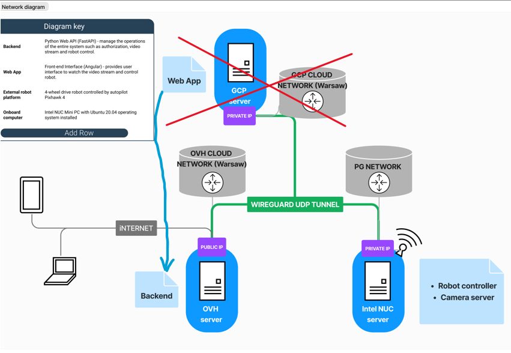
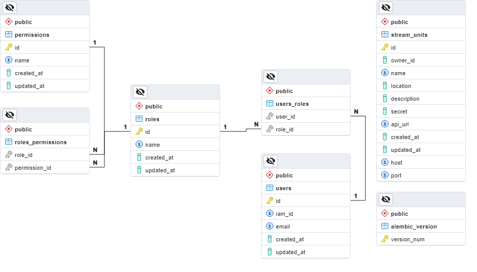

# research-project-VR-controlled-robot

## The infrastructure




### System elements:
1. Intel NUC Server with installed Ubuntu 20.04
2. Local Network (Wifi) on PG (Gdańsk University of Science)
3. OVH Virtual Private Server
4. Private device (computer/laptop)
5. ??? Additional server on GCP

### Network tools:
The configuration of these tools was defined using ansible in [path](ansible/wariatinc/robot/).

#### Wireguard (VPN)
It is a key element of the infrastracture. It provides a communication between OVH Server and Intel NUC Server. To configure properly the VPN Server on OVH you can run the following command:
```
ansible-playbook -i hosts.ini playbooks/config.yml --tags "wireguard, wireguard_server" -v --limit ovh_server
```
To configure the peer (in our case Intel NUC Server) you can run the following command: 
```
ansible-playbook -i hosts.ini playbooks/config.yml --tags "wireguard, wireguard_client" -v --limit ovh_server
```
!!! Remember to provide all needed credentials.
Example .conf files for wireguard you can find in [README.md](ansible/README.md)
You can also connect your own computer to Wireguard VPN Server (on OVH Server) to have an access to Intel NUC Server in internal network. 

#### nftables
It is used to enable port forwarding between external user and Intel NUC Server. User can communicate on public ip address of OVH Server and then is forwarded to Intel NUC Server on specific port. For example:
```
ssh robot@vps-035c50e6.vps.ovh.net -p 1024 

# vps-035c50e6.vps.ovh.net - public domain of OVH Server
```
In addition, with nftables we opened only the necessary ports.
To configure nftables on OVH Server such command was used:
```
ansible-playbook -i hosts.ini playbooks/config.yml --tags "nft" --limit ovh_server
```
To configure nftables on Intel NUC Server such command was used:
```
ansible-playbook -i hosts.ini playbooks/config.yml --tags "nft" --limit nuc
```
Ports and IP addresses were defined in group_vars. 

## System setup
After configuring the network, it is possible to setup the system.


### Prerequisites

Install on specific server the right software.
#### Onboard computer (Intel NUC Server)
* gstreamer (Detailed instruction: [README.md](robot/camera/README.md))
* Python >= 3.9 
* ROS

#### Backend (OVH Server)
* Python 3.11.4
* Docker 
* Docker Compose
* just ([command runner](https://github.com/casey/just))

#### Frontend 
! It's described in separate repository: ***research-project-VR-controlled-robot-frontend***

### Launching the system

1. Launch manually on Onboard Computer the Camera Server
> [!IMPORTANT]  
> Connect the USB Camera to Onboard Computer
```
# directly
. << repo location >>/research-project-VR-controlled-robot/robot/camera/build/Camera
# or remotely by port forwarding
ssh -t robot@51.83.134.183 -p 1024  "cd << repo location >>/research-project-VR-controlled-robot/robot/camera && ./build/Camera
```
You can test a communication with Camera Server using **nc** (netcat) tool

2. Connect Onboard Computer to External Robot Platform and run Robot Controler Server
    * Connect robot to Onboard Computer
    * Install MAVROS on Onboard Computer
    * Setup the ROS catkin workspace on Onboard Computer ([tutorial](https://dabit-industries.github.io/turtlebot2-tutorials/08b-ROSPY_Building.html))
    * Place in your workspace 2 scripts from repo path: [working_scripts](robot/streaming_server/working_scripts)
    * Test communication with robot
    * Run server script ```python << your workspace path >> /robot_command_server.py```

3. Run backend on OVH Server (it might be your own server)

> [!IMPORTANT]  
> Configure your own SSO: **Oauth2** and provide in [.env](backend/.env.template) 
> file: IAM_CLIENT_ID, IAM_CLIENT_SECRET, IAM_DOMAIN, IAM_ALGORITHM
>
> How to obtain the Bearer Token:
>
> 1. Send request:
>    ```http://<< OVH Server >>:<< App port >>/api/auth?redirect_uri=/```
>    
>    The user will be automatically added to users table in database
> 2. Log in SSO
> 3. Copy **token=** ... from url
> 4. Paste copied token on page [jwt.io](https://jwt.io/)
> 5. **id_token** is your Bearer Token
> 6. Test authentication by sending this request:
>    ```
>    curl --request GET \
>        --url http://<< OVH Server >>:<< App port >>/api/auth/test \
>        --header 'Authorization: Bearer << YOUR TOKEN >>'
>    ```
> 7. Add other roles for your user by running this query:
>    ```
>    INSERT INTO users_roles VALUES(user_id, role_id)
>    ```

```
just setup
```
This command: 
* create a venv using your Python system interpreter (should be 3.11)
* install required packages to venv
* build FastAPI application using docker-compose file: [compose.yml](backend/compose.yaml)
* create Postgres database using docker-compose 
* init database with data from [db_init.gz](backend/db/db_init.gz)
* run migration on database using alembic migration tool 

List of available **just** commands:
```
Available recipes:
    app-bash
    build-and-run
    build-app
    compile-packages
    create-venv
    default
    init-db
    install-local
    lint
    migrate-db message
    psql
    remove-containers
    run-app
    setup
    upgrade-db
```

You can configure backend using file [.env](backend/.env.template). Please read [REDME.me](backend/README.md)

The backend endpoints can be accessed through Swagger at the following address:
```
http://<< OVH Server >>:<< App port >>/docs
```
[List of endpoints](docs/endpoints.png)


**Postgres Database Schema**



## DEMO
[yt: Demo Robot 19.01](https://youtu.be/rOzNvMsJUbY)